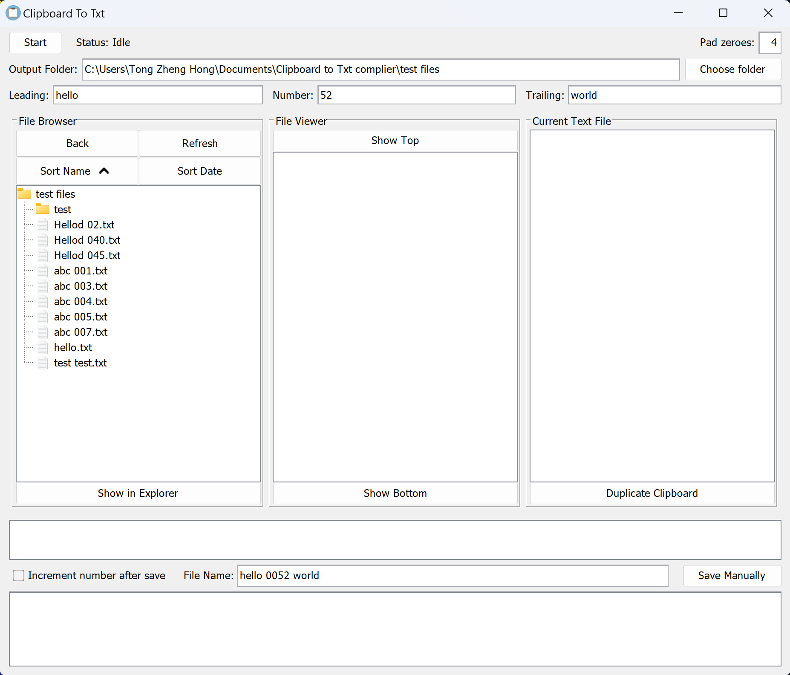

# Clipboard to Txt Complier

## A Java project that helps compile user copied content into text files 

Clipboard to Txt Complier listens to clipboard changes and temporarily stores them together before the user saves it as a text `.txt` file. Comes with in an in-built file browser and file viewer section to help manage and view saved text files.

### Features

* Input desired output folder or select via Windows file explorer
* Control how file names are saved with leading, number and trailing text fields 
* In-built file browser similar to Windows file explorer with sort by name and date modified functionality
* File viewer section to view previously saved text files within current folder
* Right click on text file for popup menu to open file, open with Notepad++, rename or remove file 
* Open Windows file explorer for more features 

An in-depth user guide can be found [here](UserGuide.md).

## Download

Compiled versions of the ClipboardToTxt can be found in the `output_rar` directory. 
- Download the latest version and extract the rar file to a desired folder. 
- Launch the .exe file within the extracted folder to start using ClipboardToTxt complier.

Note: Java is not required to run this program! :grin:

## Find a bug? 

If you found an issue or would like to submit an improvement to this project, please submit an issue using the issues tab above. If you would like to submit a PR with a fix, reference the issue you created!

## Known Issues

The program might crash when copy operations are executed too quickly. 

If the program becomes unresponsive, please restart the program. To prevent this from happening, please **pause** slightly between copy operations. 