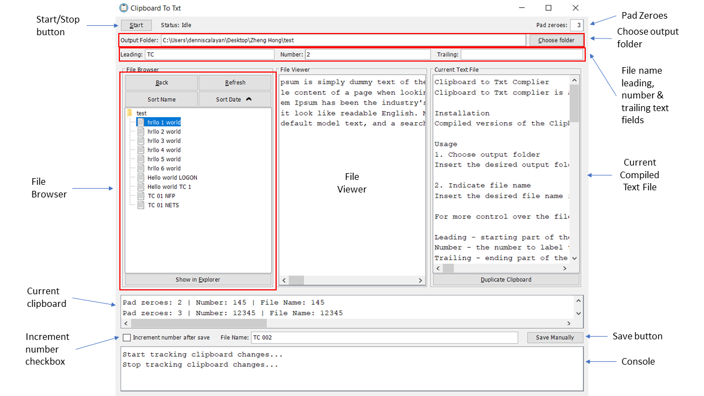

# User Guide

Instructions on how to use Clipboard to Txt Complier!

## 1. Choose output folder
Insert the desired output folder where your text files will be saved to in the `Output Folder` text field. 

You can also select `Choose folder` to do so. When a valid directory is selected, the contents of the folder will be shown in the file browser area. 

## 2. Indicate file name
Insert the desired file name in the `File Name` text field. 

For more control over the file name, you can use the `Leading`, `Number` and `Trailing` text fields.
- **Leading** - starting part of the final file name
- **Number** - the number to label the file name (Only **positive numbers** (no decimals) can be input in this field!)
- **Trailing** - ending part of the final file name

The contents of the three text fields will be combined (leading, number, trailing) together to form the file name in the `File Name` text field.

| Leading | Number | Trailing | File name |
| :-----: | :----: | :------: | :-------: |
|  Hello  |   1    | World | Hello 1 World |

Alternatively, you can directly amend the desired file name by editing the `File name` field without the need of the leading, number and trailing fields.

| Leading | Number | Trailing | File name |
| :-----: | :----: | :------: | :-------: |
| <*empty*> | <*empty*> | <*empty*> | Hello world |

When saving file, the `File name` text field **cannot be empty**. An error will be shown if the file name field is left empty. 

## 3. Starting the complier
Click `Start` at the top left hand corner.

The complier to start listening to clipboard changes and the status will change to "Tracking". You can toggle it again to stop tracking clipboard changes.

## 4. Copying content
Once tracking has started, you can navigate to other programs and start copying text. 

- Every section of copied text will be shown in the `clipboard` section (Above `File Name` and `Save Manually` button). 
- The  accumulated text will be shown in the `Current Text File` section. 

> Important: Please **PAUSE** in between copy operations. If not, the program might become unresponsive and will require a *restart*.

Note: The same text copied *multiple* times will **NOT** be accumulated to the current text file. Only the first instance will be recorded to prevent multiple accidental copy operations recorded. 

If you would like to record multiple instances of the same text, click `Duplicate clipboard` as many times as required. 

## 5. Saving file
Once the desired texts have been copied, you can click the `Save Manually` button or use `Ctrl+S` keyboard shortcut. This will save the accumulated text to the desired output folder and file name. 

> If file name already exists in current output folder, you will be asked to override existing file with the new content. 

If `Increment number after save` checkbox is checked, the value in `Number` text field will be incremented after a file is saved.

# Additional features

## Increment number after save
By checking this checkbox, the value in the `Number` text field will be incremented when a new text file is saved. In the case of recording text with incremental file names, it can be useful to check this option. 
If you would like to keep the existing number at any point, uncheck this field.

## File browser popup menu
More file operations can be accessed through the popup menu when right clicking files in the file browser.

1. **Open**
2. **Open with Notepad++ program**
3. **Rename** - If renamed file is an existing file, you can choose to override the existing file or abort the operation)
4. **Delete** - Will ask user to confirm delete operation

Note: These file operations can only be performed on **text** files only! For more functionality, please access the files in Windows file explorer by clicking `Show in Explorer`.

## File browser actions
At the top of file browser section, there are four buttons to control file browser:
1. **Back** - Navigate to parent directory of the current folder
2. **Refresh** - Update file browser with any changes (usually required if changes are made externally in Windows file explorer)
3. **Sort Name** - Sort files by name in ascending or descending order (Indicated with arrow)
4. **Sort Date** - Sort files by last modified date in ascending or descending order (Indicated with arrow)

For sorting, folders will be shown on top for ascending order while files will be shown on top for descending order

## Pad zeroes
Enter the **minimum** number of digits you want the number value to display. 

This feature will include leading zeroes in this number if the length of the number is lesser than the specified length.

| Pad Zeroes | Number | File Name |
| :--------: | :----: | :-------: | 
|     3      |   45   |    045    |
|     5      |   123  |   00123   |
|     2      |   45   |    45     |
|     3      |  12345 |   12345   |
